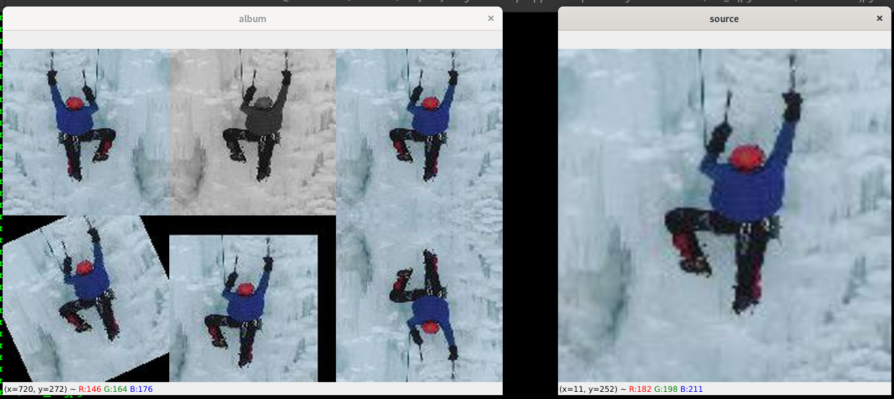

# mbr-sift-knn-image-similarity
<p align="center"> 
  
  <h3 align="center">
    A python script based on knn and mbr-sift for fast image search 
  </h3>  
</p>

---
---

This project aims to find the occurrences of an image by scanning a database. Two methods were used: knn and mbr-sift. The knn method allows us to reassemble images according to a certain contextual similarity. Images that are returned by the knn method are considered to be candidates for the mbr-sift method. For each image, we compute a vector of size 128 which is the result of the application of the PCA method on the features extracted by vgg16.

# contents
* [structure](#structure)
* [prerequisites](#prerequisites)
* [installation](#installation)
* [processing](#processing)
* [training](#training)
* [searching](#searching)


# structure

this project is structured in a modular way, it is linked to several libraries such as **[opencv, numpy, flask, zmq, loguru, multiprocessing]** 
It contains the :
* following directories:
    * processing
        * allows to extract features from images 
        * use vgg16 as features extractor
    * dump
    	* should be created!
        * is the target location where features will be stored 
        * the features are 128 vector generated by PCA    
    * logger
        * contains log formatting and settings
        * based on loguru 
    * searching
        * contains the logic of finding nearest neighbors based on knn over 128_features  
        * apply MBR-SIFT on the output of knn
    * utilities
    	* core of the project 
    	* group a set of functionalies such as
    	* image procesing 
    	* path manipulation 
    	* MBR-SIFT strategy  
    * utils_readme
        * contains some image, font for readme rendering 
        * can be easily extended by the user 
* following files
    * docker and git confs
        * .dockerignore
        * .gitignore
    * project libraries
        * requirements.txt 

# prerequisites
* git
* curl
* cmake 
* pkg-config 
* libatlas-base-dev 
* libboost-python-dev 
* libopenblas-dev 
* liblapack-dev
* python3
* python3-venv 
* build-essential
* uwsgi 
* ffmpeg (optional) 
* libpcre3 && libpcre3-dev (optional)

# installation 
```bash
	git clone https://github.com/Milkymap/mbr-sift-knn-image-similarity
	cd mbr-sift-knn-image-similarity
	python -m venv env 
	source env/bin/activate
	pip install -r requirements.txt
```

# processing
```python
	# this script will load all images from the target dir 
	# ../mbr\[SIFT\]-image-similarity/source/ 
	# process those images and extractt their features
	# python -m processing.process --help : in order to have a good view of how it works  
	python -m processing.process 
		--source ../mbr\[SIFT\]-image-similarity/source/ 
		--target dump/descriptors.pkl 
		--model_path models/vgg16.pt 
		--nb_workers 2 
		--port 8500 
		--batch_size 4 
		--dim 128
```
# training
```python
	python -m searching.search_knn 
		--debug 
		train 
		-n 16 
		-d dump/descriptors.pkl 
		-k models/knn.joblib
```

# searching 
```python
	# this script load a source image and the extracted features
	# apply knn to get the nearest candiate according to a contextual similarity
	# apply MBR-SIFT on those candidate according to a structural similarity
	# it contains two subcommands:
	# nearest and search
	# those subcommand can be chained one after another 
	# python -m processing.process nearest --help : in order to have a good view of how it works
	# python -m processing.process search --help : in order to have a good view of how it works
	
	python -m searching.search 
		--debug 
		nearest 
		-n 16 
		-s ../mbr\[SIFT\]-image-similarity/source/000_#.jpg 
		-k models/knn.joblib -m models/vgg16.pt 
		-d dump/descriptors.pkl  
		search-map 
		--size 128 128 
		--nb_workers 8
```